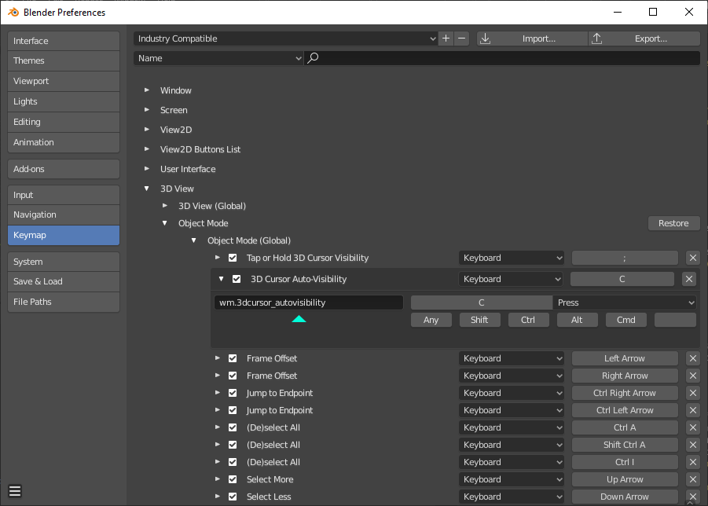

# 3D Cursor Auto-Visibility V1.8.

# Summary
A minor improvement to the 3D Cursor viewport overlay adding a bit more automation to the 3D Cursors visivbility. It would be awesome if it could be integrated into the Blender 2.8. 

# Description
if the the 3D shortcut is pressed, it reveals the 3D Cursor but then when I press a different shortcut for a different tool, it automatically hides.  It’s a much better feature than assigning a shortcut and its really useful feature for other artists and save them from manually hiding and unhiding via viewport overlay too much. 

The add-on also respects the users who prefer the 3D Cursor visibility permanently on too via an if statement checking whether the 3d cursor is already visible or not.  If it is visible it just works as normal by setting the current tool to 3D Cursor. SO THE 3D CURSOR MUST BE HIDDEN IN THE VIEWPORT OVERLAY FIRST OTHERWISE IT WILL JUST SET TO 3D CURSOR TOOL AS NORMAL.

There are 2 versions of the addon, one is the Normal and the other has plus (+). The plus version is basically the same version as the normal one but has an additional function where you can toggle or Hold/release to change the visibility of the 3D Cursor and switch between the 3D Cursor tool and Box Select. 

# How to install
1. Download '3D Cursor Auto-Visibility.py' or '3D Cursor Auto-Visibility+.py'
2. Put the '3D Cursor Auto-Visibility.py' or '3D Cursor Auto-Visibility+.py' into the Addons folder in your Blender Directory  
3. Open Blender 2.8
4. Go to Edit>Preferences
5. Click on Addons tab and select/check the addon
7. Click on Keymaps and set the the keymap preference to your liking.
7. Restart Blender 2.8 so that the addon makes the Shortcut is made depending on the keymap preferences you are using. " \ " for standard Blender, 27X or your own keymap preferences and " C " for Industry compatible keymap. 
7. Hide the 3D Cursor in the Viewport overlay and it should be ready to use

# How to use
Press the " \ " or the " C " (Depending on the keymap preference) key to make it reveal the 3D Cursor and press a different shortcut for a different tool to Auto-Hide the 3D Cursor 

For 3D Cursor Auto-Visibility+.py:
Use previous instruction for the standard  reveal and auto Hide function.

Tap " ; "  key to toggle on or off the visibilty of the 3D Cursor and switch tools to either the 3D Cursor tool or Box Select 
OR
Hold Down " ; "  to reveal and set the 3D Cursor tool and then on release will Hide the 3D Cursor and Set B tool to Box Select tool.

# Customisations
Feel free to change the shortcut via keymap. Just remember to call the operator/function: wm.3dcursor_autovisibility like here:

However, changing the keymap for the Toggle or Hold/Release function requires a bit of changing to the script. Dont worry, it should be easy to do by following this instructions:
1. Go to Scripting tab in Blender2.8
2. Click on open and locate '3D Cursor Auto-Visibility+.py'
3. in  Lines 64, 67 and 120 change "SEMI_COLON" to any keymap you prefer.

# Special Thanks
- iceythe from Blenderartists.org
- ScaredyFish from Blender.community

#
It would be great if it could replace the existing shortcut for the 3D Cursor if it does get integrated into the blender build. Also, if anyone can suggest any improvements to enhance this add on further please let me know. Anyways keep making Blender even more awesome guys!!😀
