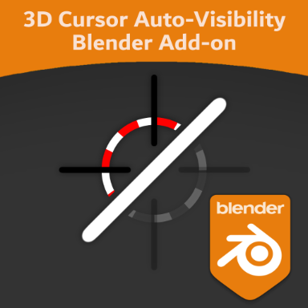
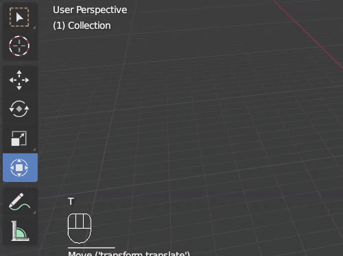
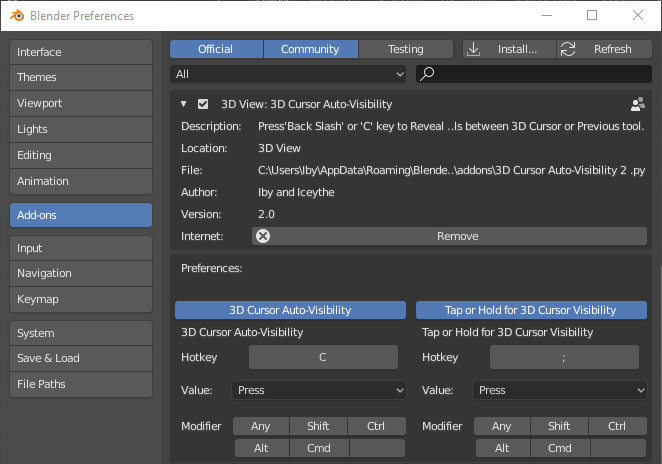

# 3D Cursor Auto-Visibility V2.0.

To download go to releases page here: https://github.com/IbyA/3D-Cursor-Auto-Visibility/releases/tag/2.0

# Summary
I noticed that when you hide the 3D Cursor via viewport overlay and Press the 3D Cursor shortcut, the 3d cursor doesn't reappear. This addon is an improvement to that 3D Cursor viewport overlay and adds bit more automation to the 3D Cursors visibility. 

# Description
if the shortcut ( 'C' for industry compatible and ' \' for default and 27X) is pressed, it reveals the 3D Cursor and sets the active tool to 3D Cursor but then when using a different tool, it automatically hides.  It’s a much better than manually hiding/unhiding the 3D Cursor in the Viewport Overlay feature than assigning a shortcut and its really useful feature for other artists and save them from manually hiding and unhiding via viewport overlay too much. 

The Auto-Hide feature does not work when the 3D Cursor is already visible. It will just set the active tool to 3D Cursor. This is useful for those special cases you don't want to Auto-Hide the 3D Cursor. If it is already hidden it will automatically hide when you press a different shortcut

# What's New in V2.0?
V2.0 now has a mini UI that allows you to customise the shortcut or enable/disable features in the addon setting.

# How to install
1. Download '3D Cursor Auto-Visibility 2.py' 
2. Put the '3D Cursor Auto-Visibility 2.py' into the Addons folder in your Blender Directory  
3. Open Blender 2.8
4. Go to Edit>Preferences
5. Click on Addons tab and select/check the addon
7. Change the Shortcut to your liking.
8. (Optional) Hide 3D Cursor in each workspace using either the Viewport Overlay shortcut you set for 'Tap or Hold for 3D Cursor Visibility shortcut' through the Viewport overlay. Then Go to File > defaults > Save Startup FIle to make the 3D Cursor hidden every time you open up Blender 
9. Restart Blender

# How to use
For 3D Cursor Auto-Visibility:

First, check if the 3D Cursor is Hidden via Viewport overlay. The addon should already do that for you. (It doesn't Auto-Hide the 3D Cursor when it is already visible. It will just set the tool to 3D Cursor. This is for those special cases you don't want to Auto-Hide the 3D Cursor)

Press the " \ "  for standard Blender, 27X or your keymap preferences and " C " for Industry compatible keymap or whatever you changed the shortcut to.  When you use a different tool, the 3d Cursor should Auto-Hide for you.

For Tap or Hold for 3D Cursor Visibility:

Tap " ; "  key or whatever shortcut you have set it to for toggling the visibility of the 3D Cursor on or off and to switch tools to either the 3D Cursor tool or the previous tool 
OR
Hold Down " ; " or whatever shortcut you have set it to reveal and set the 3D Cursor tool and then on release will Hide the 3D Cursor and Set tool to the previous tool you were using.

# Fixing Error
If you encounter any errors pressing the shortcuts (Particularly Tap or Hold for 3D Cursor Visibility), restart Blender and it should work fine. 

If the issue persists:
1. Remove the Addon
2. Reset the Keymaps back to defaults
3. Delete the Blender Foundation folder in C:\Users\(YOUR USERNAME)\AppData\Roaming (Don't Worry, Blender will regenerate this folder)
4. Reinstall the addon using the steps above.

# Special Thanks
- iceythe from Blenderartists.org

#
It would be great if it could replace the existing shortcut for the 3D Cursor if it does get integrated into the blender build but for now, this addon is the best workaround. Also, if anyone can suggest any improvements to enhance this add on further please let me know. Anyways keep making Blender even more awesome guys!!😀
